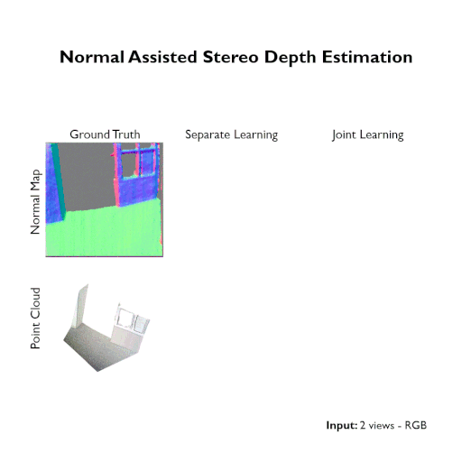

# Normal Assisted Stereo Depth Estimation

## Introduction



Accurate stereo depth estimation plays a critical role in various 3D tasks in both indoor and outdoor environments. Recently, learning-based multi-view stereo methods have demonstrated competitive performance with limited number of views. However, in challenging scenarios, especially when building cross-view correspondences is hard, these methods still cannot produce satisfying results. In this paper, we study how to enforce the consistency between surface normal and depth at training time to improve the performance. We couple the learning of a multi-view normal estimation module and a multi-view depth estimation module. In addition, we propose a novel consistency loss to train an independent consistency module that refines the depths from depth/normal pairs. We find that the joint learning can improve both the prediction of normal and depth, and the accuracy and smoothness can be further improved by enforcing the consistency. Experiments on MVS, SUN3D, RGBD and Scenes11 demonstrate the effectiveness of our method and state-of-the-art performance.

If you find this project useful for your research, please cite: 
```
@article{kusupati2019normal,
  title={Normal Assisted Stereo Depth Estimation},
  author={Kusupati, Uday and Cheng, Shuo and Chen, Rui and Su, Hao},
  journal={arXiv preprint arXiv:1911.10444},
  year={2019}
}
```

## How to use

### Environment
pytorch/pytorch:1.1.0-cuda10.0-cudnn7.5-runtime

The environment requirements are listed as follows:
- Pytorch 1.0.1 
- CUDA 10.0 
- CUDNN 7

The following dockers are suggested:
- pytorch/pytorch:1.1.0-cuda10.0-cudnn7.5-runtime
- pytorch/pytorch:1.0.1-cuda10.0-cudnn7-runtime

### Preparation
* Check out the source code 

    ```git clone https://github.com/udaykusupati/NAS.git && cd NAS```
* Install dependencies 

    ```pip install pillow scipy==1.2.1 argparse tensorboardX progressbar2 path.py h5py blessings scikit-image```
* Prepare Training Data

    * [DeMoN datasets](https://github.com/lmb-freiburg/demon)

        * Follow data preparation instructions from [DPSNet](https://github.com/sunghoonim/DPSNet)
        * Download normal map data from [demon_normals.tar.gz](LINK) and extract inside dataset directory

        ```
        |-- dataset
                |-- new_normals
                |-- preparation
                |-- test
                |-- train
        ```

    * [ScanNet](http://www.scan-net.org/)

        * Download [scannet.tar.gz](LINK)
        * Download [new_orders.zip](LINK) and extract in scannet directory

        ```
        |-- dataset
        |-- scannet
                |-- new_orders
                |-- test
                |-- test_scene.list
                |-- train
                |-- train_scene.list
                |-- val
                |-- val_scene.list
        ```

    * [SceneFlow datasets](https://lmb.informatik.uni-freiburg.de/resources/datasets/SceneFlowDatasets.en.html)

        * Follow dataset download and preparation instructions for "FlyingThings3D", "Driving" and "Monkaa" datasets from [GANet](https://github.com/feihuzhang/GANet) and create sceneflow directory.
        * Download [sceneflow_normals.tar.gz](LINK) and extract in sceneflow directory

        ```
        |-- dataset
        |-- scannet
        |-- sceneflow
                |-- camera_data
                        |-- TEST
                        |-- TRAIN
                |-- disparity
                        |-- TEST
                        |-- TRAIN
                |-- frames_finalpass
                        |-- TEST
                        |-- TRAIN
                |-- lists
                |-- normals
                        |-- TEST
                        |-- TRAIN
                |-- sceneflow_test.list
                |-- sceneflow_train.list
        ```

* Download pretrained [models](LINK) in pretrained folder

### Training
* Download the preprocessed [DTU training data](https://drive.google.com/file/d/1eDjh-_bxKKnEuz5h-HXS7EDJn59clx6V/view) from [MVSNet](https://github.com/YoYo000/MVSNet) and unzip it to ```data/dtu```.
* Train the network

    ```python pointmvsnet/train.py --cfg configs/dtu_wde3.yaml```
  
  You could change the batch size in the configuration file according to your own pc.

### Testing
* Download the [rectified images](http://roboimagedata2.compute.dtu.dk/data/MVS/Rectified.zip) from [DTU benchmark](http://roboimagedata.compute.dtu.dk/?page_id=36) and unzip it to ```data/dtu/Eval```.
* Test with your own model

    ```python pointmvsnet/test.py --cfg configs/dtu_wde3.yaml```
    
* Test with the pretrained model

    ```python pointmvsnet/test.py --cfg configs/dtu_wde3.yaml TEST.WEIGHT outputs/dtu_wde3/model_pretrained.pth```

### Acknowledgement
The code heavily relies on code from [DPSNet](https://github.com/sunghoonim/DPSNet/) (https://github.com/sunghoonim/DPSNet/)
    